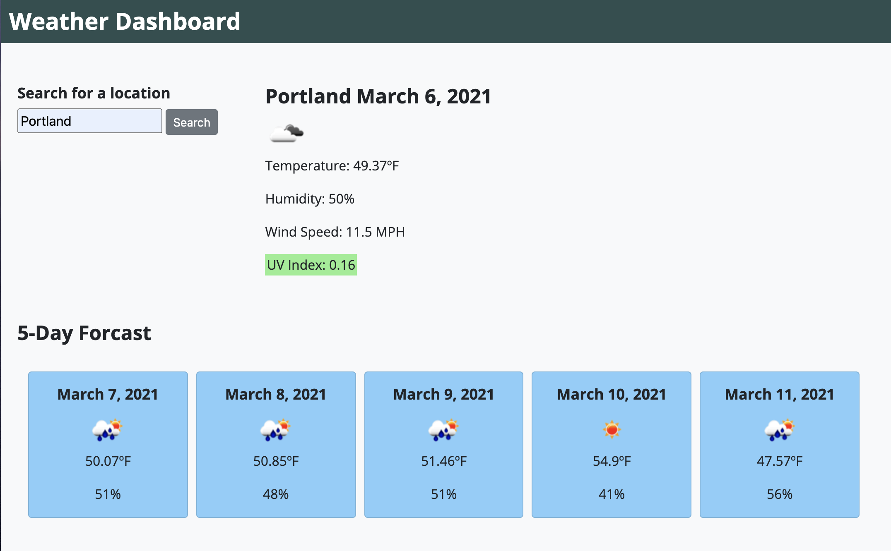
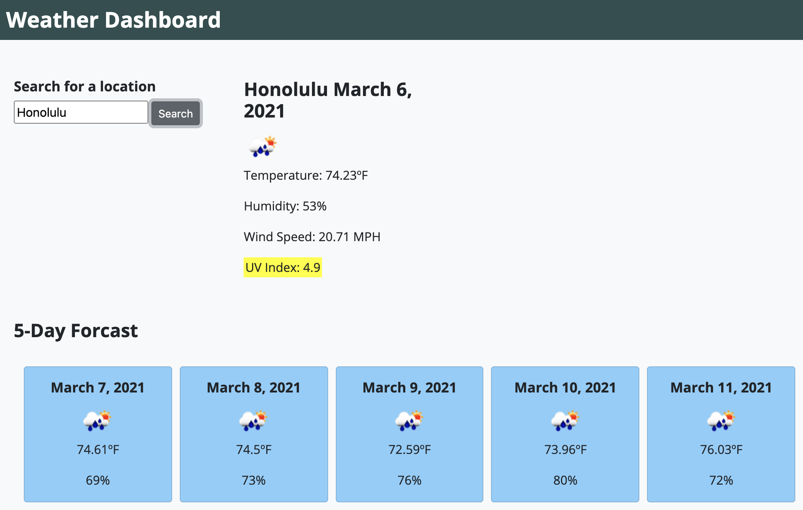

# Weather Dashboard

## Purpose
A weather dashboard built to show the current weather in the city of your choice as well as the five-day forecast.

Enter a city and press the search button to reveal the current temperature, an icon depicting current weather conditions, the wind speed, humidity level, and the UV index. The UV index is also color coded to indicate the severity. The dashboard will also show the five-day forcast.

## Technologies Used
This weather dashboard was built using
* HTML
* CSS
* JavaScript
* Open Weather APIs - Current Weather Data and One Call Weather Data

## Website
https://calliebn.github.io/weather_dashboard/

## Contributors
Callie Nipper
callie.nipper@gmail.com
